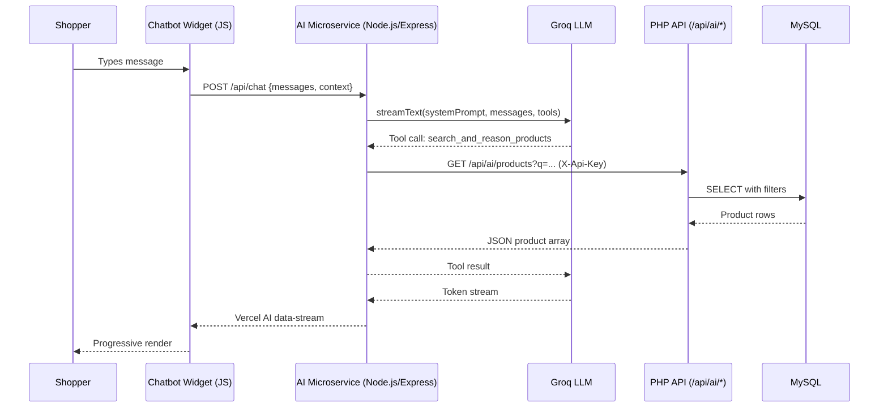

# Design Document — Autonomous Retail Concierge

## Overview

The Autonomous Retail Concierge is an agentic AI shopping assistant embedded in the Nexus-Commerce PHP 8.x storefront. It lets shoppers find products, add items to their cart, discover and apply promotional codes, and track orders through natural-language Vietnamese conversation — without leaving the current page.

The system has three layers that work together:

1. **PHP REST API** (`/commerce-core`) — A new `AiAgentController` under `/api/ai/` exposes six JSON endpoints that the AI microservice calls to read and write commerce data.
2. **Node.js AI Microservice** (`/ai-agent`) — An Express service using the Vercel AI SDK and the Groq LLM provider. It receives chat messages from the widget, reasons with the LLM, autonomously calls tools against the PHP API, and streams the response back.
3. **Chatbot Widget** (`/commerce-core`) — A single self-contained JavaScript file included via `<script>` tag in every PHP view. It renders the floating chat UI and manages real-time streaming, cart badge sync, and context passing.

**Key design decisions:**
- The PHP API is an internal service-to-service API, not a public consumer API. It is protected by a shared secret (`X-Api-Key`) rather than session-based auth.
- Cart resolution uses the shopper's existing session/user context forwarded from the widget — no new authentication is introduced.
- Streaming uses the Vercel AI SDK data-stream protocol end-to-end, from the Node.js server to the browser widget, allowing tool-call results to drive real-time UI updates (e.g., cart badge sync).
- All LLM tool implementations handle errors by returning structured `{ error }` results to the LLM rather than throwing — this lets the model relay errors to the shopper in natural language.

---

## Architecture

### High-Level Data Flow



### Component Topology

```
d:\Nexus-Commerce\
├── commerce-core/                    (PHP 8.x MVC)
│   ├── app/controllers/client/
│   │   └── AiAgentController.php     ← NEW: all /api/ai/* endpoints
│   ├── app/routes/client/client.php  ← NEW: 8 route registrations
│   ├── app/views/client/layout/      ← MODIFIED: inject window.__nexus_* vars
│   └── public/js/
│       └── chatbot-widget.js         ← NEW: self-contained widget
└── ai-agent/                         (Node.js/Express)
    ├── package.json
    ├── .env
    └── src/
        ├── index.js                  ← Express entry point
        ├── routes/
        │   └── chat.js               ← POST /api/chat handler
        └── tools/
            ├── searchProducts.js
            ├── addToCart.js
            ├── huntAndApplyPromotions.js
            └── trackOrder.js
```

### CORS & Security Flow

The PHP API and the Node.js microservice are separate origins. Two CORS policies apply:

- **PHP API → Node.js**: The PHP `AiAgentController` reads `AI_AGENT_ORIGIN` from `.env` and sets `Access-Control-Allow-Origin` to that value on all `/api/ai/*` responses. Preflight OPTIONS requests are short-circuited with `204 No Content`.
- **Node.js → Browser**: The Express server reads `ALLOWED_ORIGIN` from its `.env` and uses the `cors` middleware to permit only that origin.
- **Authentication**: Every Node.js tool call to the PHP API includes `X-Api-Key: {PHP_API_SECRET}`. The PHP controller verifies this header before any business logic runs.

---

## Components and Interfaces

### 1. PHP API Controller — `AiAgentController.php`

**Location:** `commerce-core/app/controllers/client/AiAgentController.php`

The controller follows the no-namespace pattern used by `ApiController.php`. It loads models via `require_once` and exposes a private CORS/auth guard invoked at the top of every public method.

```php
class AiAgentController
{
    private function handleCorsAndAuth(): void
    private function jsonResponse(int $status, mixed $data): never

    public function products(): void           // GET /api/ai/products
    public function variants(int $id): void    // GET /api/ai/products/{id}/variants
    public function cartAdd(): void            // POST /api/ai/cart/add
    public function promotionsOptimal(): void  // GET /api/ai/promotions/optimal
    public function checkoutApplyCoupon(): void // POST /api/ai/checkout/apply-coupon
    public function orderStatus(string $code): void // GET /api/ai/orders/{code}
}
```

**CORS/Auth guard (`handleCorsAndAuth`):**
1. Load `AI_AGENT_ORIGIN` and `AI_API_SECRET` from `.env` via `EnvSetup`.
2. Emit `Access-Control-Allow-Origin`, `Access-Control-Allow-Methods: GET, POST, OPTIONS`, and `Access-Control-Allow-Headers: Content-Type, X-Api-Key`.
3. If method is `OPTIONS`, emit `204` and exit (preflight short-circuit).
4. If `HTTP_X_API_KEY` is absent or mismatches `AI_API_SECRET`, emit `401` JSON and exit.
5. Emit `Content-Type: application/json; charset=utf-8`.

**Route registrations** added to `app/routes/client/client.php` using the existing `if ($path === ...)` and `preg_match` patterns:

```
GET  api/ai/products
GET  api/ai/products/{id}/variants    (preg_match '#^api/ai/products/(\d+)/variants$#')
POST api/ai/cart/add
GET  api/ai/promotions/optimal
POST api/ai/checkout/apply-coupon
GET  api/ai/orders/{order_code}       (preg_match '#^api/ai/orders/([A-Z0-9-]+)$#')
```

All six paths also match an early-exit preflight block: `if (str_starts_with($path, 'api/ai/') && $_SERVER['REQUEST_METHOD'] === 'OPTIONS')`.

### 2. Endpoint Specifications

#### `GET /api/ai/products`

Query params: `q` (string), `gia_min` (int ≥ 0), `gia_max` (int ≥ 0), `danh_muc_id` (int > 0), `hang` (string), `limit` (int 1–50, default 20).

SQL strategy: extends `SanPham::buildWhereClause` logic, adding subqueries for `gia_thap_nhat` and `gia_cao_nhat` (MIN/MAX of `phien_ban_san_pham.gia_ban`), `tong_ton_kho` (SUM of active variant stock), and `anh_dai_dien` (from `hinh_anh_san_pham WHERE la_anh_chinh = 1`). Products must have `trang_thai = 'CON_BAN'` and at least one variant with `trang_thai != 'NGUNG_BAN'` (enforced via `EXISTS` subquery). Default ordering: `diem_danh_gia DESC`. Price filtering applies to the minimum variant price, not `san_pham.gia_hien_thi`.

#### `GET /api/ai/products/{san_pham_id}/variants`

Uses `PhienBanSanPham::layPhienBanTheoSanPham()` filtered to `trang_thai IN ('CON_HANG', 'CON_BAN')`. Validates parent product `trang_thai = 'CON_BAN'`; returns `404` if not found. Returns `thuoc_tinh_bien_the` decoded from JSON.

#### `POST /api/ai/cart/add`

Reads JSON body: `phien_ban_id` (int), `so_luong` (int ≥ 1), `session_id` (string, optional), `nguoi_dung_id` (int, optional). Resolves cart via `GioHang::layHoacTaoGioHangUser` or `GioHang::layHoacTaoGioHangGuest`. Stock checked against `PhienBanSanPham::kiemTraTonKho`. Item added/incremented via `ChiTietGio::themVaoGio`. Returns `cart_item_count` (from `ChiTietGio::demSanPham`) and `tong_tien` (from `ChiTietGio::tinhTongTien`).

#### `GET /api/ai/promotions/optimal`

Query param: `tong_tien` (int ≥ 0). Loads all coupons where `trang_thai = 'HOAT_DONG'` AND `don_toi_thieu <= tong_tien` AND `ngay_bat_dau <= NOW()` AND `ngay_ket_thuc >= NOW()` AND (`gioi_han_su_dung IS NULL` OR `so_luot_da_dung < gioi_han_su_dung`). Applies `MaGiamGia::tinhSoTienGiam` to each. Returns the coupon with highest `tien_giam`. Returns `{ "coupon": null, "message": "..." }` when none qualify.

#### `POST /api/ai/checkout/apply-coupon`

Reads JSON body: `ma_code` (string), `tong_tien` (float ≥ 0). Calls `MaGiamGia::timTheoMaCode`, then `MaGiamGia::kiemTraHopLe`. On failure, calls `MaGiamGia::layThongBaoLoiMaGiamGia` for the Vietnamese message. On success, calculates `tien_giam` via `MaGiamGia::tinhSoTienGiam` and returns `ma_giam_gia_id`, `ma_code`, `tien_giam`, and `tong_thanh_toan = tong_tien - tien_giam`.

#### `GET /api/ai/orders/{order_code}`

Query param: `nguoi_dung_id` (int, optional). Queries `don_hang` by `ma_don_hang`. When `nguoi_dung_id` supplied, checks `don_hang.nguoi_dung_id === nguoi_dung_id`; mismatch returns `403`. Uses `DonHang::laySanPhamTrongDon` for line items.

### 3. Node.js AI Microservice

**Project structure** (`/ai-agent`):

```
ai-agent/
├── package.json
├── .env
└── src/
    ├── index.js
    ├── routes/
    │   └── chat.js
    └── tools/
        ├── searchProducts.js
        ├── addToCart.js
        ├── huntAndApplyPromotions.js
        └── trackOrder.js
```

**`package.json` key dependencies** (pinned versions):

```json
{
  "dependencies": {
    "ai": "4.3.16",
    "@ai-sdk/groq": "1.2.9",
    "express": "4.19.2",
    "cors": "2.8.5",
    "dotenv": "16.4.5",
    "zod": "3.23.8"
  }
}
```

**`src/index.js`** — Creates the Express app, mounts `cors` middleware with `ALLOWED_ORIGIN`, mounts `express.json({ limit: '1mb' })`, registers `GET /health`, mounts `chat.js` router at `/api/chat`, and adds a global error handler that returns `{ "error": "Internal server error" }` without stack traces.

**`src/routes/chat.js`** — The `POST /api/chat` handler:
1. Validates `req.body.messages` is a non-empty array; returns `400` otherwise.
2. Extracts `context = { session_id, nguoi_dung_id }` from `req.body.context`.
3. Calls `streamText({ model, system: SYSTEM_PROMPT, messages, tools, maxSteps: 5 })`.
4. Pipes the result via `result.pipeDataStreamToResponse(res)`.
5. Catches Groq errors and returns `502`.

### 4. Tool Implementations

All tools share a helper `callPhpApi(method, path, options)` that:
- Sets `X-Api-Key` header from `process.env.PHP_API_SECRET`.
- Catches network errors and returns `{ error: 'Network error: ...' }`.
- On non-2xx response, returns `{ error: 'HTTP {status}: ...' }`.

#### `searchProducts.js`

```js
export const searchAndReasonProducts = tool({
  description: 'Search the product catalogue by keyword, price range, category, or brand.',
  parameters: z.object({
    query: z.string(),
    gia_min: z.number().optional(),
    gia_max: z.number().optional(),
    danh_muc_id: z.number().optional(),
    hang: z.string().optional(),
  }),
  execute: async ({ query, gia_min, gia_max, danh_muc_id, hang }) => {
    // Build URLSearchParams, call GET /api/ai/products
    // Return raw JSON array or { error } on failure
  }
});
```

#### `addToCart.js`

```js
export const addToCartAutonomously = tool({
  description: 'Add a specific product variant to the shopper cart.',
  parameters: z.object({
    phien_ban_id: z.number().int().positive(),
    so_luong: z.number().int().min(1),
  }),
  execute: async ({ phien_ban_id, so_luong }, { context }) => {
    // POST /api/ai/cart/add with phien_ban_id, so_luong, context.session_id, context.nguoi_dung_id
    // Return { cart_item_count, tong_tien } or { error }
  }
});
```

Note: `context` is injected into `execute` via the `streamText` call in `chat.js` using the `experimental_providerMetadata` / bind-context pattern supported by Vercel AI SDK v4. Concretely, `chat.js` wraps tools with a closure that captures `context` before passing them to `streamText`.

#### `huntAndApplyPromotions.js`

```js
export const huntAndApplyPromotions = tool({
  description: 'Find and automatically apply the best available coupon for the cart.',
  parameters: z.object({
    tong_tien: z.number().min(0),
  }),
  execute: async ({ tong_tien }) => {
    // Step 1: GET /api/ai/promotions/optimal?tong_tien={tong_tien}
    // If no coupon returned, return { available: false, message: '...' }
    // Step 2: POST /api/ai/checkout/apply-coupon { ma_code, tong_tien }
    // Return { ma_code, tien_giam, tong_thanh_toan } or { error }
  }
});
```

#### `trackOrder.js`

```js
export const trackOrderStatus = tool({
  description: 'Look up the status and details of a specific order by its order code.',
  parameters: z.object({
    order_code: z.string(),
  }),
  execute: async ({ order_code }, { context }) => {
    // Build URL: GET /api/ai/orders/{order_code}?nguoi_dung_id={...}
    // Return full order JSON, or { error } with appropriate message
  }
});
```

### 5. Chatbot Widget (`chatbot-widget.js`)

A single IIFE-wrapped JavaScript file, included via:
```html
<script src="/js/chatbot-widget.js"></script>
```

**Internal structure:**

```
(function() {
  // 1. Config — reads window.__nexus_session_id, window.__nexus_user_id, AI_AGENT_URL constant
  // 2. DOM factory — creates FAB, chat window, message list, input, send button
  // 3. State — messages[], isStreaming bool, welcomeShown bool
  // 4. render() — diffless re-render of message list
  // 5. sendMessage() — append user message, call streamChat(), disable send
  // 6. streamChat() — fetch POST /api/chat, read Vercel AI data-stream
  // 7. parseStreamChunks() — extract text deltas and tool-call results
  // 8. syncCartBadge(count) — update [data-cart-count], animate highlight
  // 9. renderLinks(text) — replace /san-pham/{slug} patterns with <a> tags
  // 10. Event wiring — FAB click, send button click, Enter key
})();
```

**Streaming protocol:** The widget uses the Vercel AI SDK data-stream format. The `pipeDataStreamToResponse` call on the server emits newline-delimited JSON frames. The widget reads these via `response.body.getReader()` and a `TextDecoder`. Text delta frames (type `"0"`) are appended to the current AI bubble. Tool-result frames (type `"9"` for tool call results) are parsed to detect `add_to_cart_autonomously` results and trigger `syncCartBadge`.

**Context injection:** The PHP layout view emits:
```html
<script>
  window.__nexus_session_id = <?= json_encode(htmlspecialchars(session_id(), ENT_QUOTES)) ?>;
  window.__nexus_user_id = <?= json_encode($currentUserId ?? null) ?>;
</script>
```

The widget reads these at initialisation. Every `POST /api/chat` request includes `{ messages, context: { session_id, nguoi_dung_id } }`.

---

## Data Models

### PHP API Response Shapes

#### Product Search Item
```
id               int
ten_san_pham     string
slug             string
hang_san_xuat    string
ten_danh_muc     string
gia_thap_nhat    float  (VND)
gia_cao_nhat     float  (VND)
diem_danh_gia    float  (0–5)
anh_dai_dien     string (URL)
tong_ton_kho     int
```

#### Variant Item
```
id                    int
sku                   string
ten_phien_ban         string
mau_sac               string|null
thuoc_tinh_bien_the   object  (decoded JSON)
gia_ban               float
gia_goc               float|null
so_luong_ton          int
trang_thai            string
```

#### Cart Add Response
```
cart_item_count   int    (total distinct variants in cart)
tong_tien         float  (total cart value VND)
```

#### Optimal Promotion Response
```
coupon:
  ma_code           string
  loai_giam         "PHAN_TRAM"|"SO_TIEN"
  gia_tri_giam      float
  giam_toi_da       float|null
  don_toi_thieu     float
  tien_giam         float   (calculated)
  ngay_ket_thuc     string  (datetime)
message             string|null
```

#### Apply Coupon Response
```
ma_giam_gia_id    int
ma_code           string
tien_giam         float
tong_thanh_toan   float
```

#### Order Status Response
```
ma_don_hang         string
trang_thai          string
tong_thanh_toan     float
ngay_tao            string
ten_nguoi_nhan      string
sdt_nguoi_nhan      string
dia_chi_giao_hang   string
san_pham: [
  ten_san_pham               string
  ten_phien_ban              string
  so_luong                   int
  gia_tai_thoi_diem_mua      float
]
```

### Node.js Chat Request/Response

#### `POST /api/chat` Request
```json
{
  "messages": [{ "role": "user"|"assistant", "content": "..." }],
  "context": {
    "session_id": "string",
    "nguoi_dung_id": 123
  }
}
```

#### `POST /api/chat` Response
Vercel AI SDK data-stream (newline-delimited text frames):
- Type `"0"`: text delta
- Type `"9"`: tool result (contains tool name and result JSON)
- Type `"d"`: stream finish metadata

### Environment Configuration

#### `commerce-core/.env` (additions)
```
AI_AGENT_ORIGIN=http://localhost:3001
AI_API_SECRET=your-shared-secret-here
```

#### `ai-agent/.env`
```
PORT=3001
PHP_API_BASE_URL=http://localhost:8080
PHP_API_SECRET=your-shared-secret-here
GROQ_API_KEY=gsk_...
ALLOWED_ORIGIN=http://localhost:8080
```

---

## Correctness Properties

*A property is a characteristic or behavior that should hold true across all valid executions of a system — essentially, a formal statement about what the system should do. Properties serve as the bridge between human-readable specifications and machine-verifiable correctness guarantees.*

### Property 1: Product search response completeness

*For any* combination of valid filter parameters, every product object in the returned array SHALL contain all nine required fields: `id`, `ten_san_pham`, `slug`, `hang_san_xuat`, `ten_danh_muc`, `gia_thap_nhat`, `gia_cao_nhat`, `diem_danh_gia`, `anh_dai_dien`, and `tong_ton_kho`.

**Validates: Requirements 1.1**

### Property 2: Product search filter correctness

*For any* keyword `q`, every product in the response SHALL have `ten_san_pham` or `hang_san_xuat` containing `q` (case-insensitive), and no product whose name and brand both exclude `q` SHALL appear.

**Validates: Requirements 1.2**

### Property 3: Price range filter correctness

*For any* `gia_min` and/or `gia_max` values, every product in the response SHALL have its minimum variant price within the specified range, and no product outside that range SHALL appear.

**Validates: Requirements 1.3**

### Property 4: Active-only product invariant

*For any* request to `GET /api/ai/products`, every product in the response SHALL have `trang_thai = 'CON_BAN'` and SHALL have at least one variant with `trang_thai != 'NGUNG_BAN'`.

**Validates: Requirements 1.6**

### Property 5: Result count bound

*For any* `limit` value between 1 and 50, the number of products in the response SHALL be at most `limit`.

**Validates: Requirements 1.9**

### Property 6: Invalid parameter rejection

*For any* request where a filter parameter contains a value that cannot be cast to its expected type (e.g., alphabetic string for `gia_min`), the response status SHALL be `400` and the response body SHALL contain a `message` field.

**Validates: Requirements 1.10**

### Property 7: Variant response completeness and status filter

*For any* active product, every variant object returned by `GET /api/ai/products/{id}/variants` SHALL contain all required fields (`id`, `sku`, `ten_phien_ban`, `mau_sac`, `thuoc_tinh_bien_the`, `gia_ban`, `gia_goc`, `so_luong_ton`, `trang_thai`) and SHALL have `trang_thai` equal to `'CON_HANG'` or `'CON_BAN'`.

**Validates: Requirements 2.1, 2.2**

### Property 8: Cart add round-trip

*For any* valid `phien_ban_id` and `so_luong` with a valid cart context, after calling `POST /api/ai/cart/add`, the cart SHALL contain that variant with a quantity at least equal to the requested `so_luong`, and the response SHALL include `cart_item_count` and `tong_tien`.

**Validates: Requirements 3.1, 3.3**

### Property 9: Cart duplicate prevention (quantity accumulation)

*For any* variant added to the cart twice with quantities `q1` and `q2`, the cart SHALL contain exactly one entry for that variant with total quantity `q1 + q2` rather than two separate entries.

**Validates: Requirements 3.2**

### Property 10: Insufficient stock rejection

*For any* add-to-cart request where the requested `so_luong` exceeds the variant's `so_luong_ton`, the response status SHALL be `422`.

**Validates: Requirements 3.5**

### Property 11: Optimal coupon selection

*For any* `tong_tien` value and any set of eligible coupons, the coupon returned by `GET /api/ai/promotions/optimal` SHALL produce a `tien_giam` greater than or equal to the `tien_giam` of every other eligible coupon for that `tong_tien`.

**Validates: Requirements 4.1, 4.2**

### Property 12: Apply coupon calculation correctness

*For any* valid coupon `ma_code` and `tong_tien`, the `tien_giam` returned by `POST /api/ai/checkout/apply-coupon` SHALL equal the result of `MaGiamGia::tinhSoTienGiam(coupon, tong_tien)`, and `tong_thanh_toan` SHALL equal `tong_tien - tien_giam`.

**Validates: Requirements 5.2**

### Property 13: Order ownership access control

*For any* order and any `nguoi_dung_id` that is not the order's owner, the response to `GET /api/ai/orders/{code}?nguoi_dung_id={id}` SHALL be `403`.

**Validates: Requirements 6.2**

### Property 14: Order response completeness

*For any* existing order code, the response SHALL include `ma_don_hang`, `trang_thai`, `tong_thanh_toan`, `ngay_tao`, `ten_nguoi_nhan`, `sdt_nguoi_nhan`, `dia_chi_giao_hang`, and a `san_pham` array where each item has `ten_san_pham`, `ten_phien_ban`, `so_luong`, and `gia_tai_thoi_diem_mua`.

**Validates: Requirements 6.1**

### Property 15: API key authentication invariant

*For any* request to any `/api/ai/*` endpoint that is missing the `X-Api-Key` header or where `X-Api-Key` does not match `AI_API_SECRET`, the response status SHALL be `401`.

**Validates: Requirements 7.5**

### Property 16: hunt_and_apply_promotions two-step orchestration

*For any* `tong_tien` for which the PHP API returns an eligible coupon, the `hunt_and_apply_promotions` tool SHALL automatically call both `GET /api/ai/promotions/optimal` AND `POST /api/ai/checkout/apply-coupon` within a single tool invocation, and the tool result SHALL contain `ma_code`, `tien_giam`, and `tong_thanh_toan`.

**Validates: Requirements 12.2, 12.3, 12.4**

### Property 17: Cart badge synchronisation

*For any* completed `add_to_cart_autonomously` tool-call result containing a `cart_item_count` value `n`, the `[data-cart-count]` element in the page DOM SHALL display `n` after the stream is processed.

**Validates: Requirements 17.1**

### Property 18: Context XSS safety

*For any* session ID or user ID value — including those containing HTML special characters — the values assigned to `window.__nexus_session_id` and `window.__nexus_user_id` in the PHP layout view SHALL be JSON-encoded and output-escaped such that no unescaped HTML or JavaScript executes.

**Validates: Requirements 18.3**

---

## Error Handling

### PHP API Error Response Format

All error responses follow a consistent shape:
```json
{ "message": "Human-readable description in Vietnamese" }
```
HTTP status codes used: `400` (bad input), `401` (missing/invalid API key), `403` (ownership mismatch), `404` (not found), `422` (business rule violation, e.g. insufficient stock or invalid coupon state), `500` (unexpected server error).

### PHP API Input Validation

Each endpoint validates its inputs before touching models:
- Numeric params (`gia_min`, `gia_max`, `danh_muc_id`, `limit`, `tong_tien`): checked with `ctype_digit` or `is_numeric`; non-conforming values return `400`.
- Integer params cast with `(int)`, float params with `(float)`.
- String params sanitized via `addslashes` / `mysqli_real_escape_string` before interpolation into SQL (consistent with existing model pattern).
- Path params (e.g. `san_pham_id`, `order_code`) validated by the route `preg_match` pattern before the controller is invoked.

### Node.js Tool Error Handling

All `execute` functions in tool files wrap their fetch calls in try/catch. On failure they return a structured error object rather than throwing:
```js
try {
  const response = await fetch(...);
  if (!response.ok) {
    return { error: `HTTP ${response.status}: ${await response.text()}` };
  }
  return await response.json();
} catch (err) {
  return { error: `Network error: ${err.message}` };
}
```
This ensures the LLM receives a description of what went wrong and can relay it to the shopper in natural language.

### Node.js Route Error Handling

The `POST /api/chat` handler catches Groq API errors separately from tool errors:
- Missing/invalid `messages` → `400` before calling `streamText`.
- `streamText` throws (e.g. Groq unavailable) → `502 { "error": "AI service unavailable" }`.
- Uncaught synchronous errors bubble to the Express global error handler → `500 { "error": "Internal server error" }` (no stack trace in response).

### Widget Error Handling

- Network error on `fetch` → display Vietnamese error message in chat, re-enable send button.
- Non-2xx HTTP from AI Agent → display error from `response.json().error` or a fallback Vietnamese string.
- Stream read error mid-response → append error message to current AI bubble, re-enable send button.

---

## Testing Strategy

### Overview

Two complementary testing layers cover the feature:

- **Property-based tests** — verify universal correctness properties across many generated inputs, particularly for the PHP API's filtering, validation, and business-logic calculation endpoints.
- **Integration/example tests** — verify specific scenarios, infrastructure wiring, tool orchestration, and the Node.js microservice endpoints using mocked dependencies.

PBT is appropriate here because the PHP API endpoints contain non-trivial input-to-output transformations (filtering, coupon selection, discount calculation) where 100+ varied inputs will surface edge cases that a handful of examples would miss. The Node.js tools are external-service wrappers; they are tested with mocked PHP API responses.

### PHP API Tests (PHPUnit)

**Property-based tests** using [eris/eris](https://github.com/giorgiosironi/eris) or a similar PHP PBT library:

| Test | Property | Min Iterations |
|------|----------|----------------|
| `ProductSearchFieldsTest` | Property 1 | 100 |
| `ProductSearchKeywordTest` | Property 2 | 100 |
| `ProductPriceRangeTest` | Property 3 | 100 |
| `ActiveProductInvariantTest` | Property 4 | 100 |
| `ResultCountBoundTest` | Property 5 | 50 |
| `InvalidParamRejectionTest` | Property 6 | 100 |
| `VariantResponseTest` | Property 7 | 100 |
| `CartAddRoundTripTest` | Property 8 | 100 |
| `CartAccumulationTest` | Property 9 | 100 |
| `StockRejectionTest` | Property 10 | 100 |
| `OptimalCouponSelectionTest` | Property 11 | 100 |
| `ApplyCouponCalcTest` | Property 12 | 100 |
| `OrderOwnershipTest` | Property 13 | 100 |
| `OrderResponseFieldsTest` | Property 14 | 100 |
| `ApiKeyAuthTest` | Property 15 | 50 |

Each test is tagged: `// Feature: autonomous-retail-concierge, Property {N}: {property_text}`

**Example tests** (PHPUnit):
- Default product ordering (diem_danh_gia DESC, 20 results max) — Req 1.8
- Guest cart vs. user cart resolution — Req 3.7
- No eligible coupon → `{ coupon: null }` — Req 4.3
- Apply coupon 404 (code not found), 422 (expired, used up, below minimum) — Req 5.3, 5.4
- Guest order lookup (no nguoi_dung_id) — Req 6.4
- CORS headers present + preflight returns 204 — Req 7.1–7.4

### Node.js AI Microservice Tests (Jest)

**Property-based tests** using [fast-check](https://github.com/dubzzz/fast-check):

| Test | Property | Min Iterations |
|------|----------|----------------|
| `huntAndApplyOrchestrationTest` | Property 16 | 100 |
| `cartBadgeSyncTest` | Property 17 | 100 |

**Integration/example tests** (Jest with `supertest`, mocked `fetch` via `jest.fn()`):
- `GET /health` → `{ status: 'ok' }` — Req 8.3
- `POST /api/chat` with valid messages returns streaming response — Req 9.1
- `POST /api/chat` without messages → `400` — Req 9.5
- `search_and_reason_products` calls PHP API with correct query params — Req 10.2
- `add_to_cart_autonomously` forwards context correctly — Req 11.2
- `track_order_status` appends nguoi_dung_id when present — Req 13.2
- `hunt_and_apply_promotions` when no coupon available → correct message — Req 12.5
- Tool errors returned as structured objects, not thrown — Req 10.5, 11.5, 12.6, 13.6

### Frontend Widget Tests (Vitest + jsdom)

**Property-based tests** (fast-check):

| Test | Property | Min Iterations |
|------|----------|----------------|
| `cartBadgeUpdateTest` | Property 17 | 100 |
| `contextXssTest` | Property 18 | 200 |

**Example tests**:
- FAB click opens/closes chat window — Req 15.2, 15.3
- Welcome message shown on first open — Req 15.5
- Typing indicator shown during stream, hidden after — Req 15.6
- Slug URL rendered as clickable link — Req 16.4
- Network error shows Vietnamese error message — Req 16.5

### System Prompt Specification

The `SYSTEM_PROMPT` constant in `src/routes/chat.js`:

```
Bạn là trợ lý mua sắm AI cho Nexus-Commerce, chuyên tư vấn điện tử và hàng tiêu dùng tại Việt Nam.

QUY TẮC:
1. Luôn trả lời bằng tiếng Việt trừ khi khách hàng dùng ngôn ngữ khác.
2. Khi khách hàng bày tỏ sự quan tâm đến sản phẩm, chủ động gọi search_and_reason_products ngay lập tức mà không cần hỏi thêm.
3. Sau khi thêm sản phẩm vào giỏ hàng thành công, chủ động gọi hunt_and_apply_promotions để tìm mã giảm giá tốt nhất.
4. Trước khi gọi add_to_cart_autonomously, LUÔN xác nhận với khách hàng về tên phiên bản và giá sản phẩm.
5. Hiển thị giá bằng đồng Việt Nam theo định dạng "34.990.000 ₫".
6. Khi giới thiệu sản phẩm, bao gồm đường dẫn theo định dạng /san-pham/{slug}.
7. Nếu công cụ trả về lỗi, hãy thông báo cho khách hàng bằng ngôn ngữ thân thiện và đề xuất lựa chọn thay thế.
```

**Validates: Requirements 14.1–14.6**
